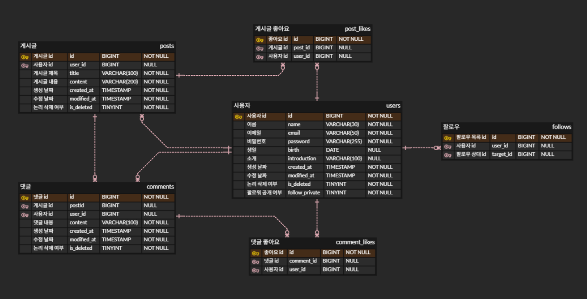

# NewsFeedProject

> Spring Boot 기반 소셜 뉴스피드 서비스  
> 게시물(Post), 댓글(Comment), 좋아요(Like), 유저(User), 팔로우(Follow) 기능 포함

---

## 프로젝트 개요

NewsFeedProject는 사용자 간의 게시물 공유, 댓글 작성, 좋아요 기능을 제공하는 뉴스 피드 서비스입니다.  
JWT 기반 인증과 Spring Security를 적용하여 안전한 접근 제어를 지원하며, Soft Delete 방식을 사용하여 데이터 보존 및 관리가 용이합니다.

---

## 기술 스택

- **Backend:** Java 17, Spring Boot 3
- **Database:** MySQL 8
- **Security:** Spring Security, JWT
- **ORM:** Spring Data JPA, Hibernate
- **Build:** Gradle
- **Validation:** Bean Validation (jakarta.validation)
- **Auditing:** Spring Data JPA Auditing (생성/수정일 자동 관리)


---

## 프로젝트 구조
```
com.example.newsfeedproject
├── common
│ ├── config // Security, PasswordEncoder 등 설정
│ ├── dto // API 공통 응답 DTO
│ ├── entity // JPA 엔티티 (User, Post, Comment, Like 등)
│ ├── exception // CustomException 및 ErrorCode 정의
│ └── security // JWT, CustomUserDetails 등
├── user
│ ├── controller // 유저 API 컨트롤러
│ ├── service // 유저 비즈니스 로직
│ ├── repository // UserRepository
│ └── dto // Request/Response DTO
├── post
│ ├── controller
│ ├── service
│ ├── repository
│ └── dto
├── comment
│ ├── controller
│ ├── service
│ ├── repository
│ └── dto
├── like
│ ├── postLike
│ │ ├── controller
│ │ ├── service
│ │ ├── repository
│ │ └── dto
│ └── commentLike
│ ├── controller
│ ├── service
│ ├── repository
│ └── dto
├── follow
│ ├── repository
│ └── service
└── NewsFeedProjectApplication.java
```

---

## 주요 기능

### 1. 유저(User)
- 회원 조회: 단건 조회, 전체 조회(이름 필터링 가능)
- 회원 수정: 이름, 비밀번호, 생년월일, 소개글, 팔로우 공개/비공개 설정
- 회원 삭제: Soft Delete (데이터는 DB에 남음)
- 비밀번호 검증 및 변경 가능

### 2. 게시물(Post)
- 게시물 생성, 조회(단건/전체), 수정, 삭제
- Soft Delete 적용
- 전체 조회 시 페이징 및 정렬 가능
- 팔로우한 유저만 조회 옵션 지원
- 게시물 좋아요(PostLike) 수 집계
- 댓글(Comment) 수 집계

### 3. 댓글(Comment)
- 댓글 작성, 조회, 수정, 삭제
- 댓글 좋아요(CommentLike) 수 집계

### 4. 좋아요(Like)
- 게시물 좋아요(PostLike) CRUD
- 댓글 좋아요(CommentLike) CRUD
- 중복 좋아요 방지
- 좋아요 취소 가능

### 5. 팔로우(Follow)
- 사용자 간 팔로우 관계 관리
- 팔로우한 사용자 게시물 필터 조회 가능
- 비공개 팔로우 설정 가능

### 6. 인증 및 보안(Auth)
- **JWT 기반 인증**
    - 로그인 시 액세스 토큰 발급
    - Authorization 헤더에 토큰 포함하여 요청
- **인증 필요 API**
    - 게시물 작성/수정/삭제
    - 댓글 작성/삭제
    - 좋아요 생성/삭제
    - 유저 정보 수정/삭제
- **권한 검증**
    - 본인 게시물/댓글만 수정/삭제 가능
    - 비밀번호 검증 후 유저 삭제 가능

---

## 페이징 및 정렬
- Spring Data JPA `Pageable` 사용
- 기본 페이지 크기: 10
- 정렬 기준: `createdAt` DESC
- 옵션:
    - `all=true`: 전체 조회
    - `onlyFollow=true`: 팔로우한 유저 게시물만 조회

---

## 데이터 구조

- **ERD 및 상세 명세:** [ERD 링크]([https://www.erdcloud.com/d/ZzYDqpv52LfAdz6an])

- 주요 테이블:
    - `User`: 유저 정보
    - `Post`: 게시물
    - `Comment`: 댓글
    - `PostLike`: 게시물 좋아요
    - `CommentLike`: 댓글 좋아요
    - `Follow`: 팔로우 관계


- **API 상세설명 :** [API 명세서 링크]([https://www.notion.so/API-2b88ec9c265a81d2994ec65bbec72dd8])

---

## 주요 설계 및 특징

- **JWT 기반 인증 & Spring Security 사용**
- **JWT 필터 사용** : 회원가입, 로그인 API 제외 모든 API에 인증 인가 적용
- **양방향 연관관계 최소화**
- **Soft Delete**: 게시물, 댓글, 유저 등 삭제 시 실제 삭제가 아닌 삭제 플래그 처리
- **Exception Handling**: 공통 CustomException 및 ErrorCode 사용
- **DTO 설계**: 요청/응답 DTO로 API 명세와 데이터 반환 일관성 유지
- **Repository Layer**: JPA Repository + Query Annotation 사용
- **조회 최적화**: @EntityGraph 활용으로 N+1 문제 최소화

---

## 패키지별 역할 요약

| 패키지 | 역할                            |
|--------|-------------------------------|
| `common` | 공통 설정, 보안, 예외처리, 엔티티          |
| `user` | 회원 관련 기능 (CRUD, 인증, 팔로우)      |
| `post` | 게시물 관련 기능 (CRUD, 조회, 좋아요 연동)  |
| `comment` | 댓글 관련 기능 (CRUD, 조회, 좋아요 연동)   |
| `like` | 게시물/댓글 좋아요 기능                 |
| `follow` | 팔로우 기능 (관계 생성, 조회, 비공개 여부 확인) |

---

## 예외 처리(ErrorCode)

- CustomException & ErrorCode로 통합
- HandlerExceptionResolver 활용한 JWT 필터 내 예외 핸들링

- 주요 예외:
    - NOT_FOUND_USER / POST / COMMENT
    - ACCESS_DENIED
    - PASSWORD_MISMATCH / PASSWORD_IS_SAME
    - ALREADY_POSTLIKE / ALREADY_COMMENTLIKE


- Response 형식 통일: `ApiResponse<T>`
---
